# DevOps and DevSecOps Blogcamp

Hello, welcome.My name is Alexio Junior Aaron, and this blog  is about learning DevOps and DevSecOps the way it's actually practiced in the industry not the tutorial version, the real version.And today, I want to show you the full picture.

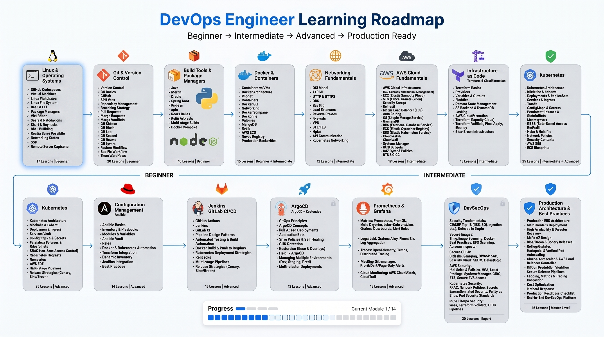

This roadmap right here this is the complete journey we're going on together. From the very first terminal command, all the way to running secure, production-grade infrastructure at scale. Fourteen modules. Every major tool the industry actually uses.But here's the thing I want you to keep in mind throughout this entire series it was never really about the tools. Tools change. What doesn't change is understanding the underlying process, why each piece exists, how it connects to the next, and what problem it's actually solving. That's what we're building here.

We start at the foundation. Linux, Git, containers, networking, cloud. Because if you skip these, everything that comes after is just guesswork. You'll be copy-pasting commands you don't understand into systems you can't debug.

We start at the foundation. Linux, Git, containers, networking, cloud. Because if you skip these, everything that comes after is just guesswork. You'll be copy-pasting commands you don't understand into systems you can't debug.

Then we move into the layers where most engineers stop  and where senior engineers live. CI/CD pipelines, GitOps with ArgoCD, observability with Prometheus and Grafana, and then DevSecOps which is where security gets baked into every stage of your pipeline, not bolted on at the end.


And we finish where it actually counts. Production. High availability, disaster recovery, cost optimisation, end-to-end platform design. This is the module that turns an engineer into someone who can own a system.

Now I want to be honest with you about how this series is structured. We don't rush. Every module builds on the one before it. Every concept gets a real explanation, not just a command to copy. And every tool we cover, we cover because it shows up in real production environments not because it's trending on Twitter.
If you've tried to learn DevOps before and felt like you were drowning in tools without understanding the glue that holds them together  this is the series for you.So let's start at module one. Linux and Operating Systems. The foundation that everything else runs on.

## Linux & Operating Systems 

Here's why we're starting here. Every technology we're going to cover in this series Docker, Kubernetes, CI/CD pipelines, Terraform  every single one of them runs on Linux. Not Windows. Not macOS. Linux. When production goes down at 3am, you're going to SSH into a Linux machine. When your Docker container crashes, you're reading Linux logs. When your Kubernetes pod fails, you're on a Linux node.

If you skip this foundation, you're building everything else on sand. So let's build it on solid ground.

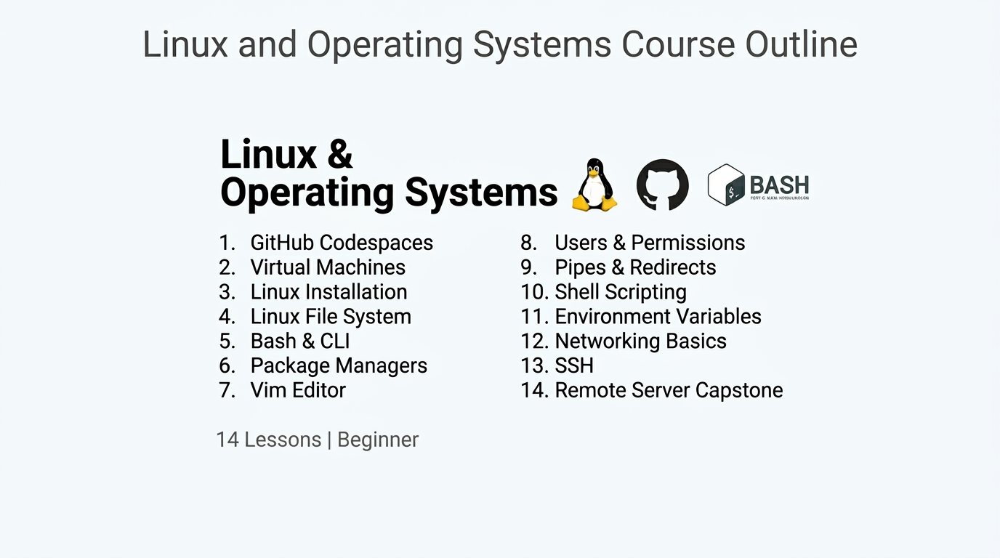

### What is an Operating system?

Let me ask you a question. When Chrome wants to save a file to your hard drive how does it actually do that?

Think about it. Chrome is just code. It has no idea whether your hard drive is an old spinning HDD, a modern NVMe SSD, or a network-attached storage device somewhere in a data centre. It has no idea what brand it is, what protocol it uses, or how to physically write a bit to it.


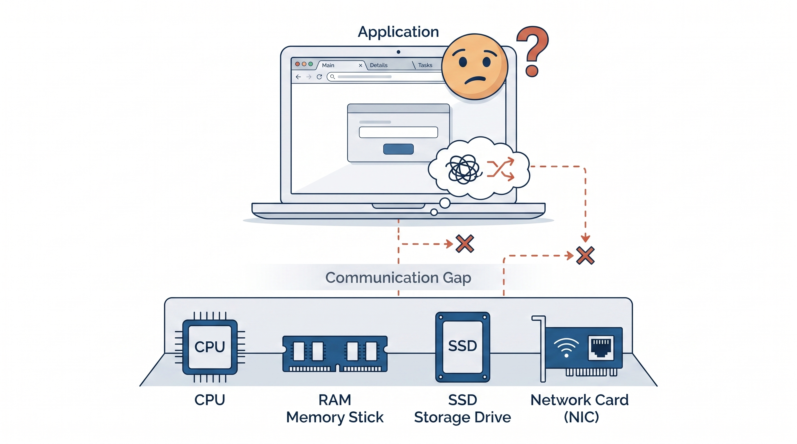

And yet  Chrome can save a file. Every time. Perfectly.How?

The answer is the Operating System. The OS sits between your applications and your hardware, and it acts as a translator. On one side it speaks "application" Chrome says "save this file." On the other side it speaks "hardware" and it knows exactly how to physically write to your specific disk.


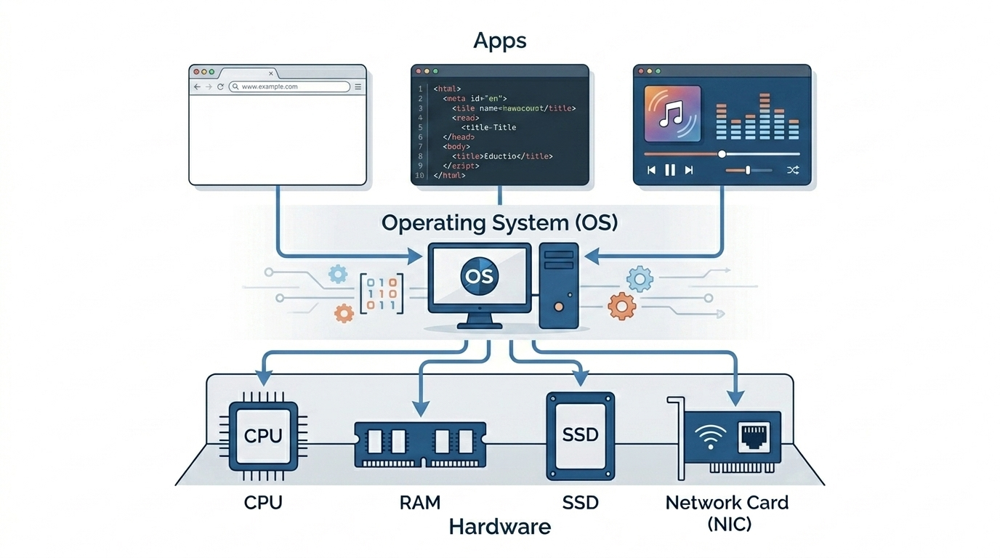

The OS is the middleman that makes all of this possible. And that's not just for storage. That's for everything. CPU time, RAM, network cards, USB devices, keyboards the OS manages all of it.


A very good example is an Operating System (Os)  is like a hotel concierge.

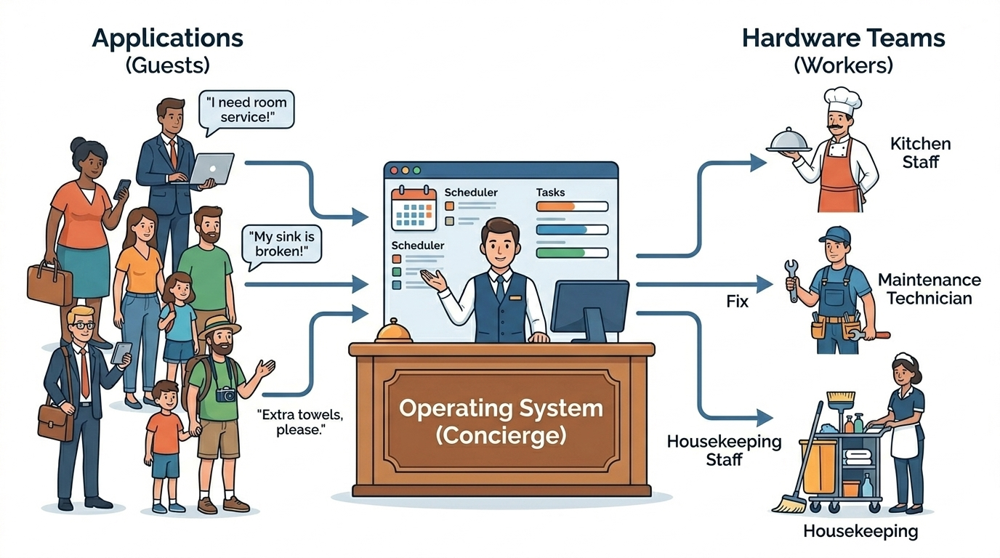

You, the guest , which is the application.You don't go find the kitchen team, negotiate with housekeeping, and track down the maintenance crew yourself. You walk up to the concierge and say "I need a wake-up call and fresh towels." The concierge handles all the coordination behind the scenes. You get what you need. You never touched the hardware.

That's exactly what an OS does.

### What are the responsibilities of an operating system?

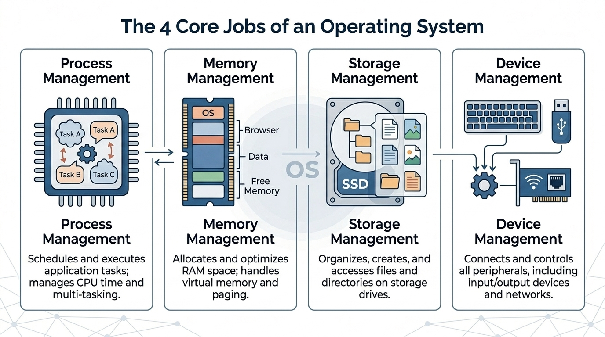

1. Process Management

2. Memory Management

3. Storage Management

4. Device Management


#### **1. Process Management**

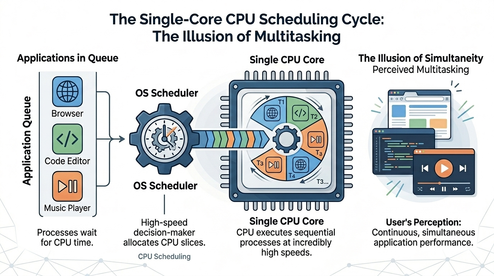

Your CPU can only do one thing at a time per core. But right now you probably have Chrome, Slack, VS Code, and Spotify all open at once. So how does that work?

The OS is a scheduler. It decides which process gets to use the CPU, for how many milliseconds, and in what order. It switches between them so fast ,we're talking thousands of switches per second that it feels like everything is running simultaneously. It's not. The OS is juggling incredibly fast.

#### **2. Memory Management**

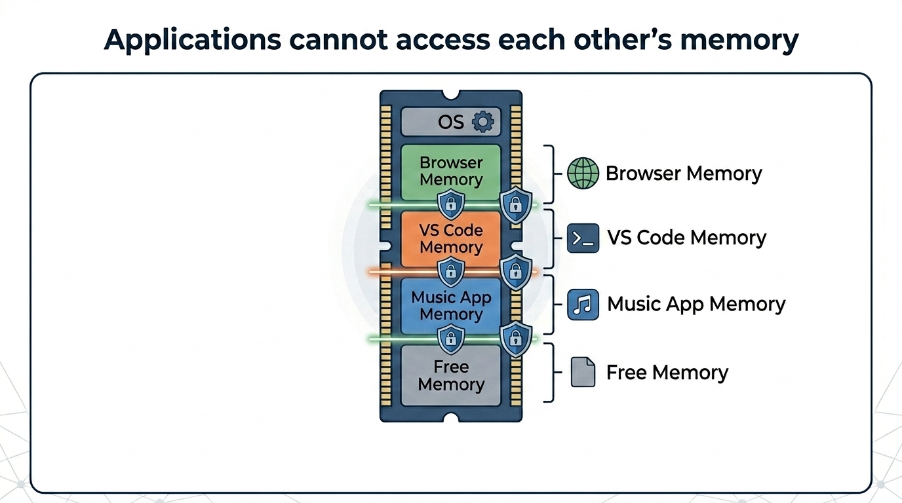

RAM is a shared, limited resource. If Chrome, VS Code, and Slack all ask for memory at the same time, the OS decides who gets what. And crucially it enforces those boundaries. One application cannot read another application's memory. That isolation is the OS enforcing rules. That's why Chrome crashing doesn't take down your entire computer.


#### **3. Storage Management**

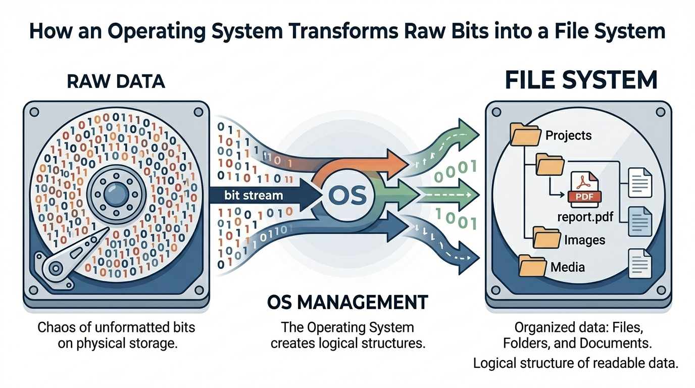

On a raw hard drive, there's no concept of a "file" or a "folder." Those are abstractions. The OS creates a file system  a structured way of organizing data on disk  so that programs can say "save this as report.pdf" and find it again later. Without the file system, your hard drive would just be a sea of undifferentiated bits(zeros and ones)


#### **4. Device Management**

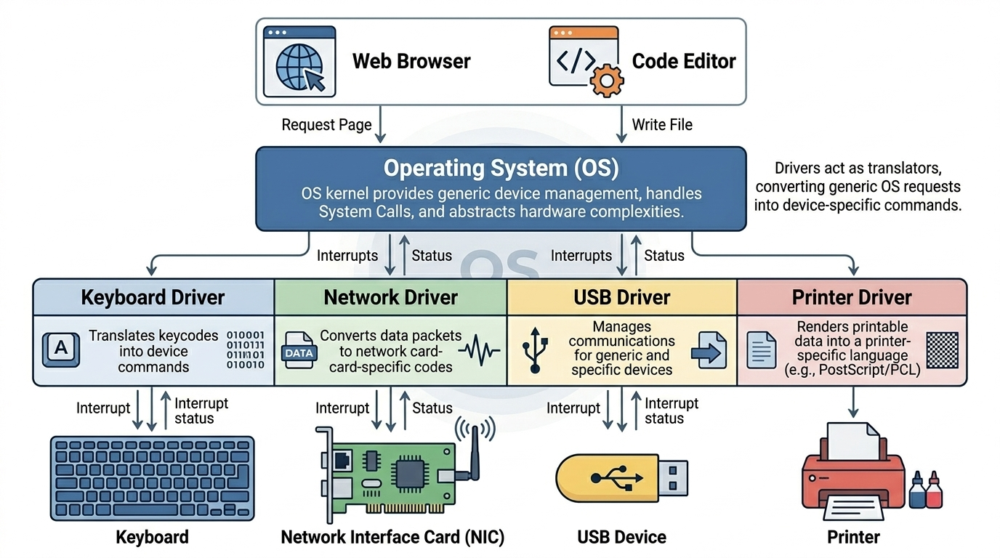

Every piece of hardware your keyboard, your network card, your USB drive needs to communicate with the OS. The way it does that is through a driver. The OS loads and manages these drivers, so that applications never have to worry about what brand of network card is installed. The OS handles it.


### What is system call?


There's a specific, formal interface between applications and the OS. It's called a system call. When Chrome wants to write a file, it makes a system call to the OS, "write this data." The OS receives that call, validates it, and carries it out.

Every programming language you use Python, Go, Node.js eventually makes system calls at the lowest level. You'll rarely write system calls yourself, but knowing they exist explains a lot about how software actually works.


### The Kernel 

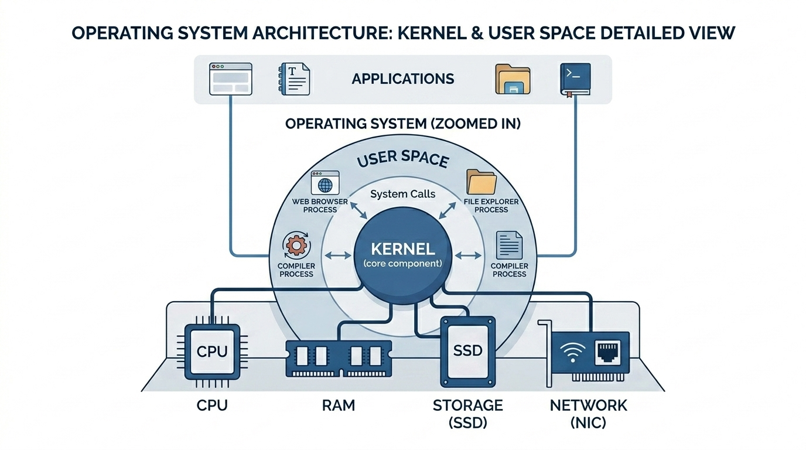


Inside the OS, there's a specific component that is responsible for everything we just described. It's called the Kernel.

The Kernel is the core program of the OS. It's one of the very first things that loads when your machine boots. It has direct, low-level access to all hardware. And here's the thing that's going to make you understand Linux much better.


### The Kernel IS Linux


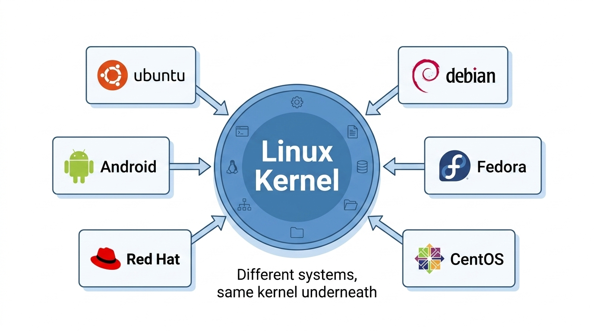

Ubuntu, Debian, CentOS, Fedora, Red Hat, even Android, they all run the same Linux Kernel underneath. What makes them different is everything that sits on top of the kernel the package manager, the default software, the desktop environment, the configuration tools.

But the kernel? Same kernel. That's why when I say "learn Linux," what I really mean is: learn the kernel's interface. Learn the commands and concepts that work the same way on every single Linux distribution you'll ever touch.


Switch to terminal. Run commands live


### Check kernel version

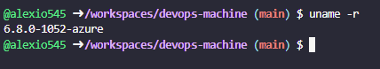


See that word "azure" in the kernel version? That's telling you this kernel was built specifically for running on Microsoft Azure, which is exactly where your GitHub Codespace lives. But it's still a standard Linux kernel at its core.


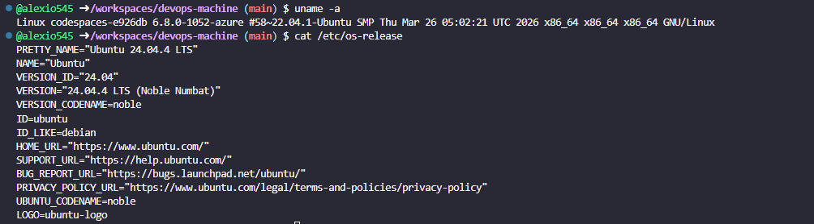
- uname with -a gives you everything kernel name, hostname,kernel release, kernel version, machine hardware, and Os


**⚠️ NOTE:** Ubuntu 22.04 LTS LTS stands for Long Term Support. Canonical, the company behind Ubuntu, commits to providing security patches for five years. In production, you always want an LTS release. No surprises, no forced upgrades.


## Kernel space

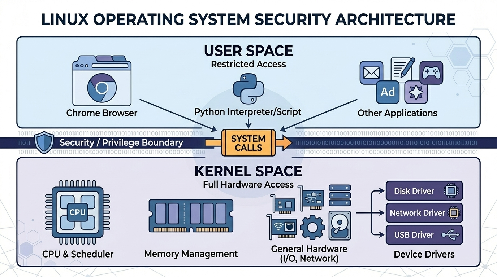


The Kernel runs in what we call "kernel space",it has unrestricted access to everything. Your applications run in "user space" a restricted environment where they can only access what the kernel allows through system calls.This separation is one of the most important security properties of Linux. An application can't directly touch hardware. It has to ask the kernel. And the kernel decides whether to allow it.


 ## LINUX vs WINDOWS vs MACOS

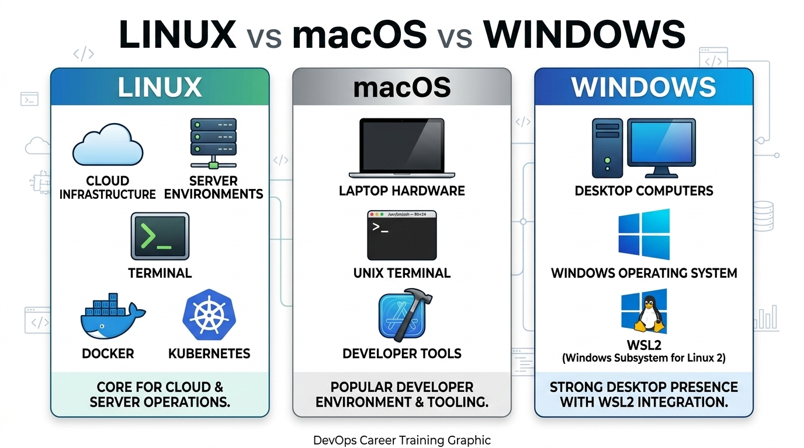


Let me give you the practical perspective on the three main operating systems from my DevOps experience.

### Linux

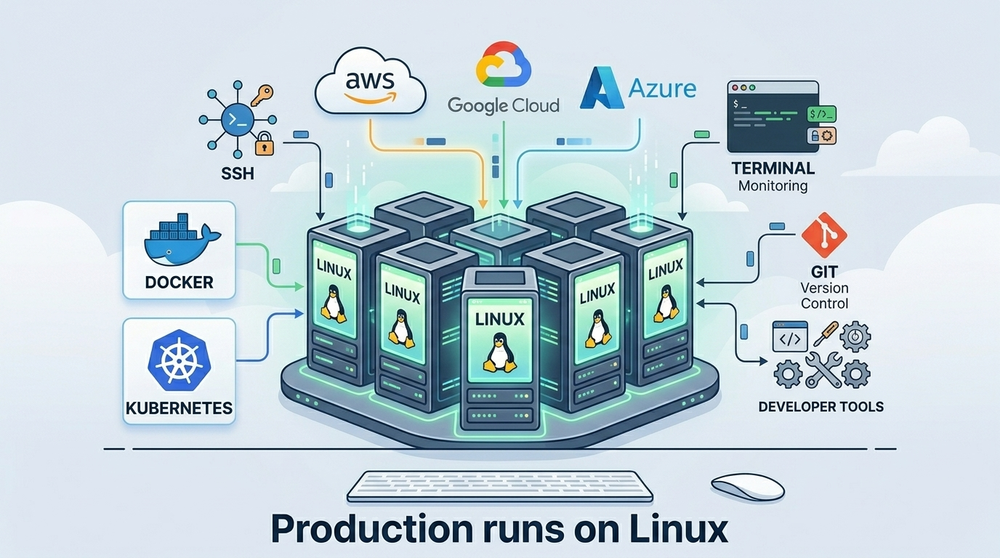

Runs roughly 96% of the world's servers.It's free and open source. It's lightweight you can run a full Linux server with no graphical interface, which means no wasted resources. Every major cloud provider AWS, Google Cloud, Azure defaults to Linux for virtual machines. Docker and Kubernetes are Linux-native technologies. They were built on Linux, for Linux.


### MacOs 
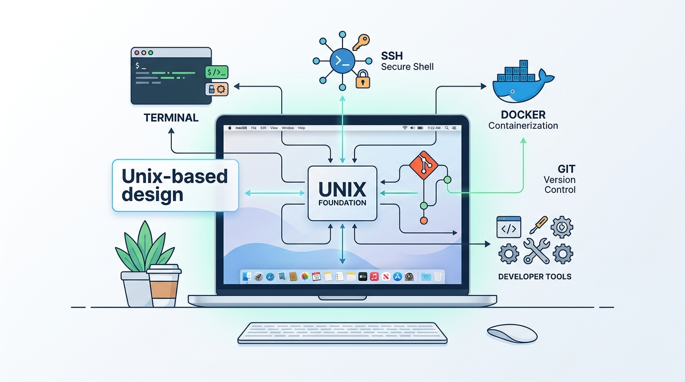
Under the hood, macOS is a Unix-based system, meaning it shares design principles and many commands with Linux. This is why most professional DevOps engineers develop on a Mac. The terminal on macOS behaves very similarly to Linux, and the tools you need just work.

### Windows 

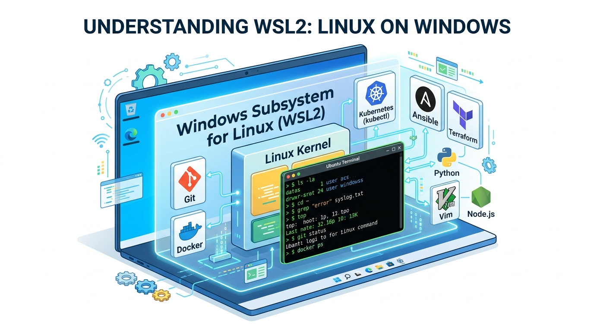

Completely different architecture. A different file system, different path conventions, different shell by default. Microsoft introduced WSL2, the Windows Subsystem for Linux,which gives you a real Linux kernel running inside Windows. It's genuinely good now. But the world of servers still runs Linux.


Here's the bottom line. As a DevOps engineer, you might develop on a Mac or Windows that's fine. But what you deploy to is Linux. Every time. The terminal skills you build in this module are the skills you'll use in production, every single day.

## VIRTUAL MACHINES 
When Amazon Web Services says you can spin up a server in 30 seconds what's actually happening? They're not pulling a physical machine off a shelf and plugging it in. They're doing something much more interesting.

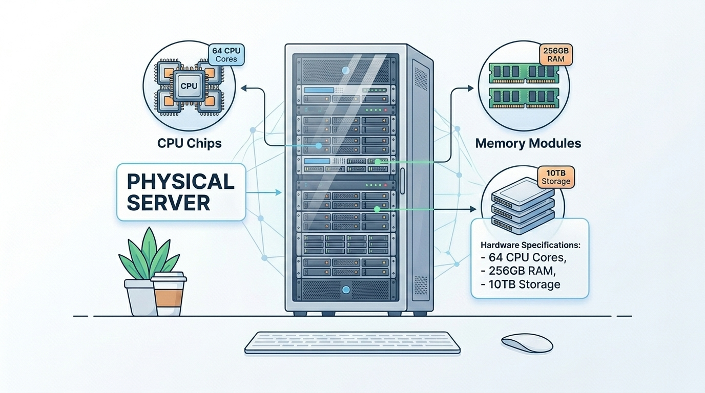

A Virtual Machine  VM for short is a computer inside a computer. You take one massive physical server and use software to slice it into multiple completely isolated virtual machines, each acting like an independent computer with its own operating system, its own storage, its own network interface.


AWS has warehouses full of these massive physical servers. When you launch an EC2 instance that's what Amazon's VMs are called you're getting a slice of one of those physical machines. That's the big secret behind cloud computing.


## Hypervisor

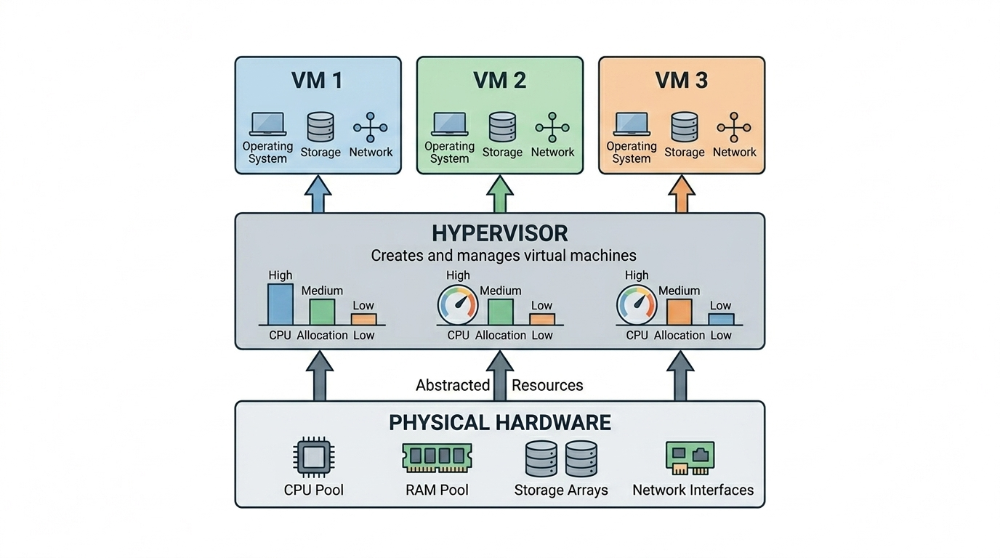

Hypervisor is the software layer that creates and manages VMs.


### Types of Hypervisors
There are two types  of hypervisors

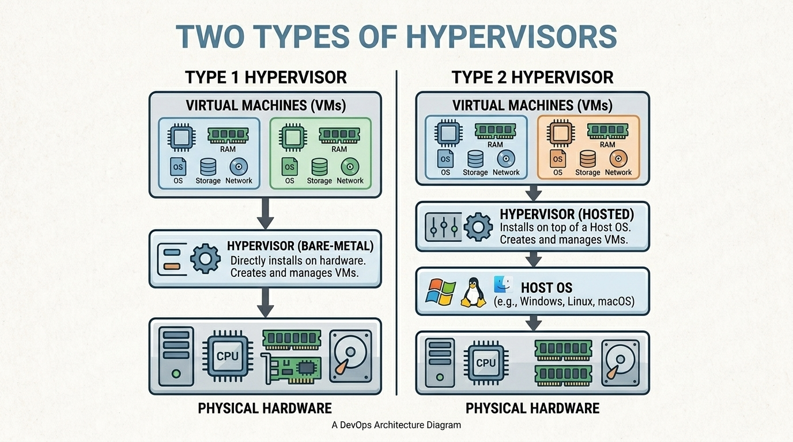

### Type 1 (Bare Metal Hypervisors)

These run directly on the physical hardware. No operating system underneath them. Examples: VMware ESXi, Microsoft Hyper-V, and AWS's own Nitro hypervisor. This is what your cloud VMs actually run on.

### Type 2(Hosted Hypervisors)

These run as a regular application on top of an existing OS. Examples: VirtualBox, VMware Workstation, Parallels on Mac. Great for learning and local development.

What makes VMs so powerful for DevOps specifically?

1. Isolation, if your app crashes the VM, the host machine keeps running. 

2. Portability, a VM is ultimately just a file on disk, you can snapshot it, back it up, and restore it. 

3. Efficiency, cloud providers pack dozens of customer VMs onto a single physical server.


## Github Codespaces 

### What is Githuib Codespaces?

GitHub Codespaces is a fully configured, cloud-hosted development environment that allows you to write, run, and debug code directly from a web browser or a local IDE(like VsCode). Behind the scenes, each "codespace" is a secure Docker container running on a virtual machine allocated specifically to you, natively attached to your GitHub repository.

### How it works?

When you launch a codespace, GitHub spins up a Linux virtual machine hosted on the cloud. By default, it uses a robust Ubuntu image preloaded with popular coding languages (like Python, Node.js, and Java) and CLI tools.If you run a web application inside your codespace, it securely forwards the application's port, giving you a private URL to live-preview your app in real-time.

### Do i need to pay for Github codespaces?

GitHub gives every free account 120 core-hours per month about 60 hours on a 2-core machine, more than enough for this entire series on personal  accounts.For organizations, administrators can configure billing policies to fund usage for their team members and external contributors. 


**⚠️ NOTE:** To conserve these compute hours, codespaces automatically pause when you stop interacting with them and can be instantly resumed later.

### 1. Create your GitHub account 

If you don't have one. Go to [github.com](https://github.com/signup) and sign up. It's free.

### 2. Create a new repository

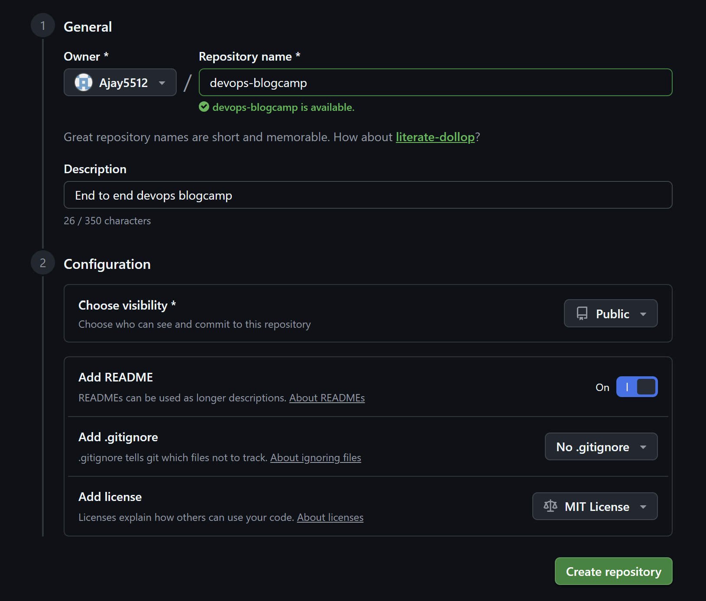

1. Click the plus icon in the top right 

2. Name it: devops-blogcamp

3. Description : End to end devops blogcamp

4. Set it to Public

4. Check "Add a README file"

5. Add license , choose MIT LIcense

6. Click "Create repository"


### 3. Open a Codespace

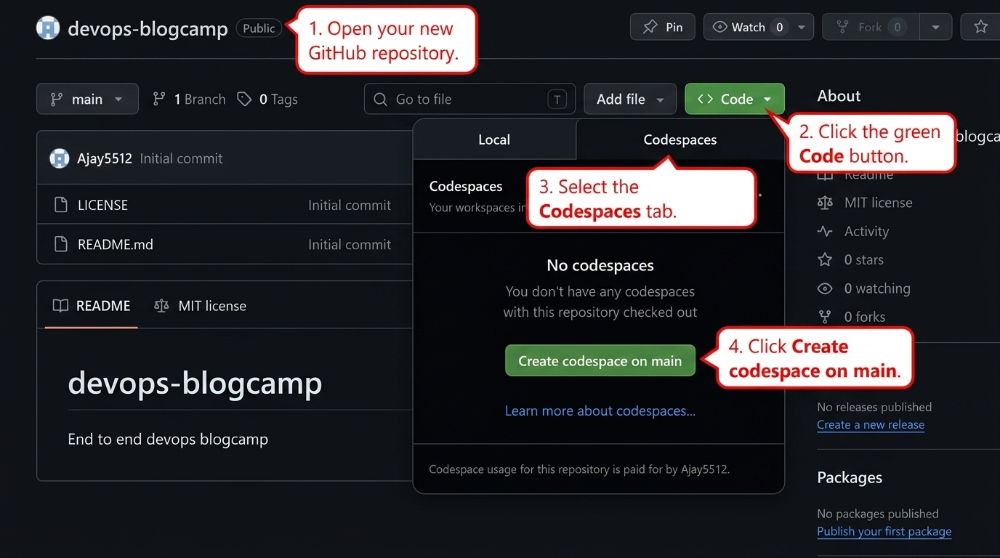

1. Open your new GitHub repository.

2. Click the green **Code** button.

3. Select the **Codespaces** tab.

4. Click **Create codespace on main**.


> **Expected result**
>
> Visual Studio Code opens in your browser with your repository ready to use.

## Workflow


```mermaid
flowchart LR
    A[Repository] --> B[Code]
    B --> C[Codespaces]
    C --> D[Create codespace]
    D --> E[VS Code opens]

```
### Creating folder structures in linux

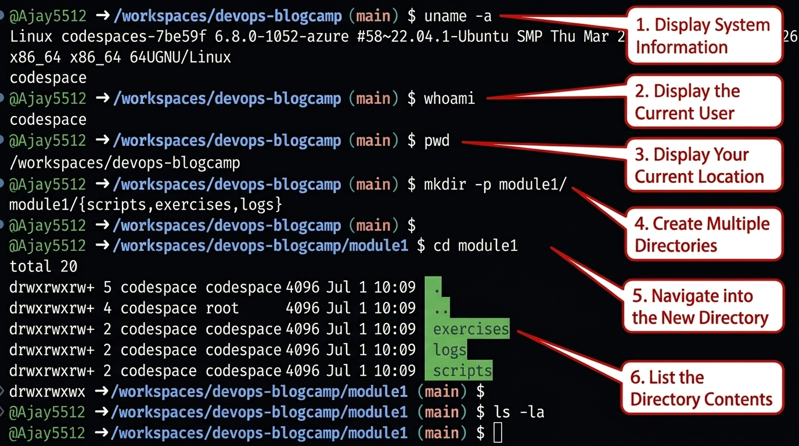


## THE LINUX FILE SYSTEM 

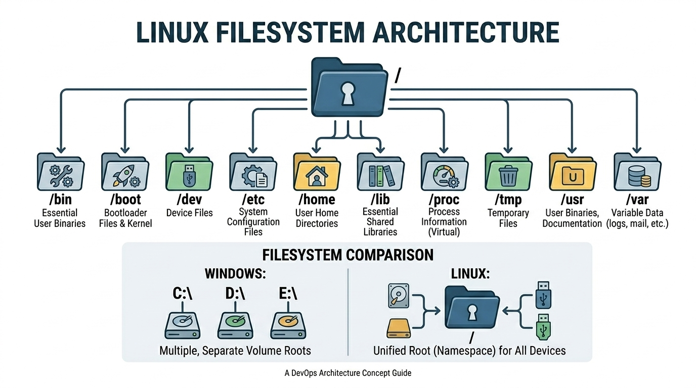

Linux that confuses almost every developer when they first encounter it. On Windows you have C:\, you might have D:\, E:\ ,multiple roots. On Linux, there is exactly one root, a single forward slash. Everything on the entire system hangs off of that single forward slash.


### Everything in linux is a file

Your keyboard,your hard drive,a running process,a network connection,a directory  are all  files , even a file is a file also, just one that contains other files.It means everything in the system can be read, written, and managed using the same set of tools.

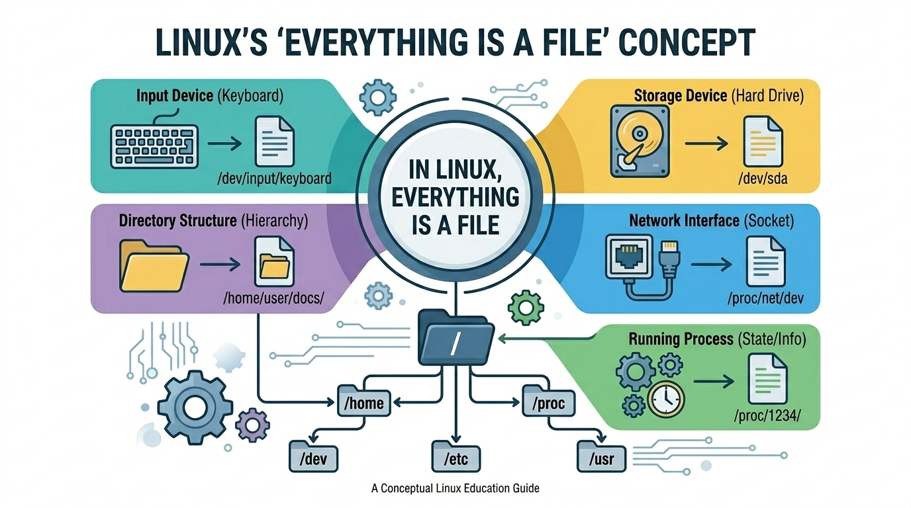


# Understanding the Linux Filesystem

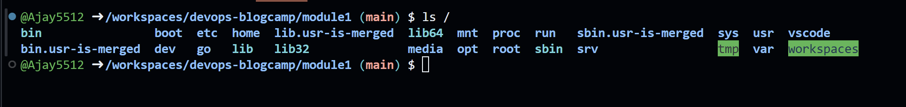

One of the first things you'll notice in Linux is that everything starts from a single root directory (`/`). Inside it are several standard directories, each serving a specific purpose.

The directories below are the ones you'll encounter most often as a DevOps engineer or system administrator.

---

### 📁 `/etc` System Configuration
Stores system-wide configuration files that control how Linux and installed services behave.

**You'll typically find**

- SSH configuration
- Hostname settings
- Network configuration
- User and group information
- Service configuration files


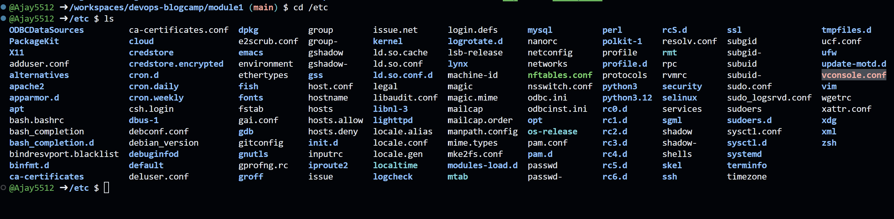

You can Think of `/etc` as the **control room** of your operating system. If you need to change how the system behaves, you'll usually edit a file here.

>⚠️ NOTE: As a **DevOps engineer**, You'll spend a lot of time in `/etc` configuring services such as Nginx, SSH, Docker, and systemd.

---

## 👤 `/home` User Home Directories

Contains the personal files and directories for every user on the system.

**Example**

```text
/home/
├── ajay/
├── bob/
└── musa/
```

Each user has their own home directory where they can store files, projects, downloads, and personal configuration.

You can think of `/home` as an **apartment building**. Every user has their own apartment with their own belongings.

>⚠️ **NOTE**: As a **DevOps engineer:** Most development work happens inside your home directory rather than system directories.

---

## ⚙️ `/bin` and `/usr/bin` — System Commands

These directories contain executable programs that you run from the terminal.

For example:

```bash
ls
cat
grep
cp
mv
mkdir
```

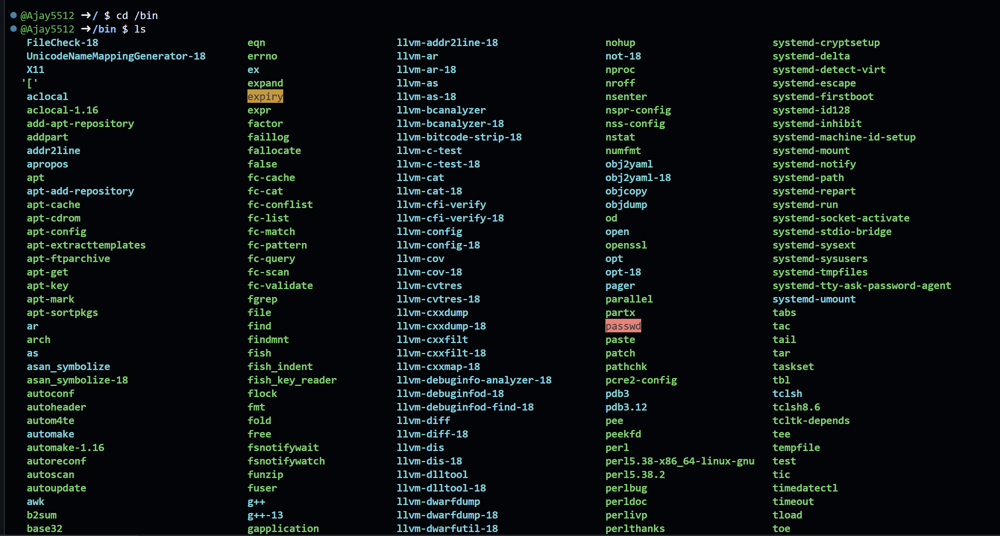

These commands are actual executable files stored in these directories.

you can think of `/bin` and `/usr/bin` as the **toolbox** of Linux. Every command you type is a tool stored here.

> 💡 **Fun fact:** When you type `ls`, Linux searches these directories to find the executable before running it.

---

## 📜 `/var/log` — System Logs

Stores log files generated by the operating system and running applications.

Example

```text
/var/log/
├── syslog
├── auth.log
├── nginx/
├── apache2/
└── journal/
```
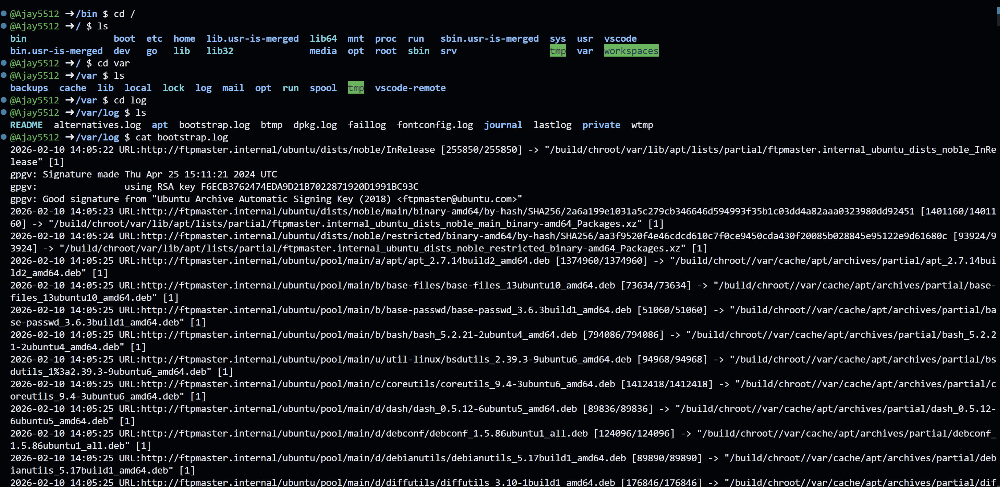
These logs record system events, errors, warnings, and application activity.

Think of `/var/log` as the **black box recorder** of your server. When something goes wrong, this is usually the first place you'll investigate.

> ⚠️ **NOTE** : As a **DevOps engineer:** Learning to read log files is one of the most valuable troubleshooting skills you can develop.

---

## 🧠 `/proc` — Kernel Information

Provides live information about the Linux kernel and running processes.

Unlike other directories, the files in `/proc` don't actually exist on disk—they're generated dynamically by the kernel.

Example

```text
/proc/
├── cpuinfo
├── meminfo
├── uptime
└── version
```

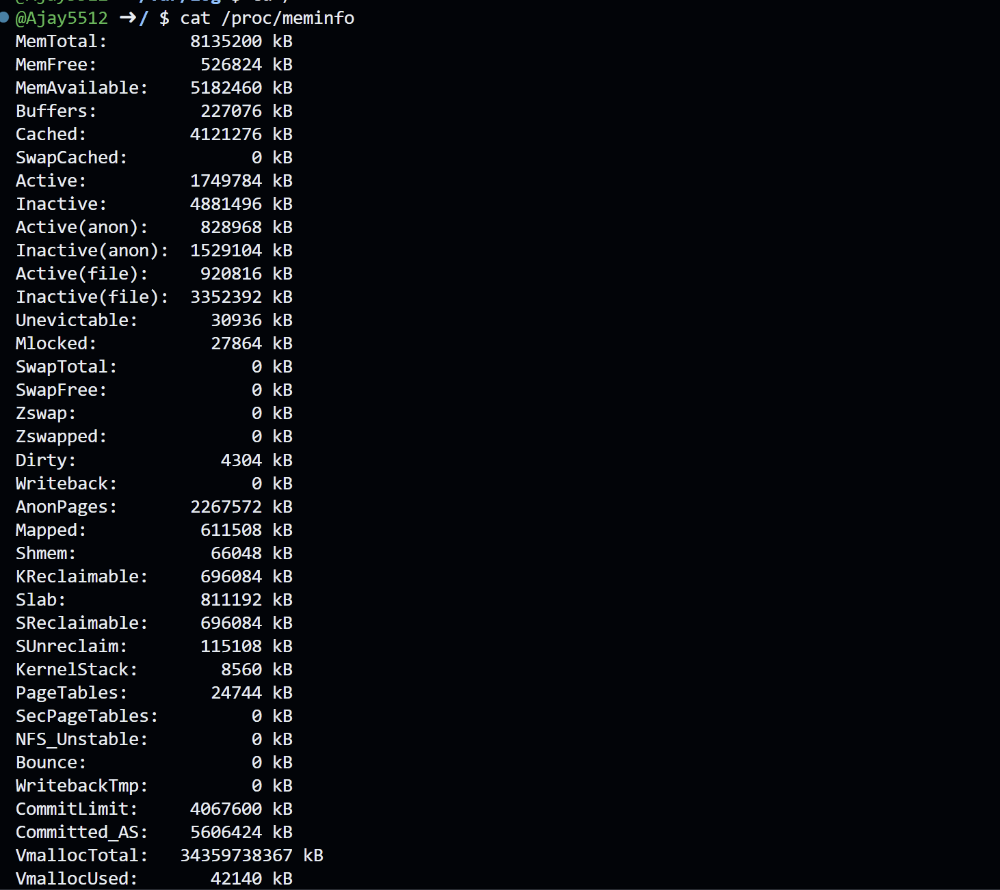

These files let you inspect your system's CPU, memory, uptime, and much more.

You can think of `/proc` as the **dashboard** of your Linux system. It shows real-time information about what's happening under the hood.

> ⚠️ **NOTE** As a **DevOps engineer:** Many monitoring tools (such as Prometheus Node Exporter) collect system metrics from `/proc`.

---

## 🗂️ `/tmp` Temporary Files

The `/tmp` directory is used to store temporary files created by the operating system and applications while they're running.

**You'll typically find**

- Temporary downloads
- Installation files
- Cached data
- Temporary scripts
- Files created during program execution

You may think of `/tmp` as a **scratch pad**. It's a place where applications jot down temporary information while they work.

>  ⚠️ **NOTE** ** The contents of `/tmp` are temporary and may be deleted automatically, especially after a system reboot. Never store important files here.

---

## 📦 `/usr/local` Locally Installed Software

The `/usr/local` directory is reserved for software installed manually by the system administrator rather than by the operating system's package manager.

**You'll typically find**

- Docker CLI
- `kubectl`
- Node.js
- Python installations
- Custom scripts and applications


You may think of `/usr/local` as your **personal toolbox**. It's where you keep additional tools that aren't included with the operating system by default.

>  ⚠️ **NOTE**  As a **DevOps engineer:** Many command-line tools you'll install throughout your career will live somewhere inside `/usr/local`.

---

# Understanding Hidden Files

Linux hides certain files by default to keep your home directory clean. These files usually contain configuration settings rather than everyday documents.

Let's see this in action.

---

## 1. Move to Your Home Directory

### Command

```bash
$ cd ~
```

### What this command does

The `cd` command changes your current directory.

The `~` (tilde) is a shortcut that always points to **your home directory**, regardless of which user is logged in.

For example, in GitHub Codespaces:

```text
~
```

is equivalent to:

```text
/home/codespace
```

> 💡 You'll use `~` constantly because it's much shorter than typing the full path every time.

---

## 2. List the Visible Files

### Command

```bash
$ ls
```

### Output

```text
# Almost nothing shows up
```

### Why?

By default, the `ls` command only displays **visible files and directories**.

Hidden files are intentionally excluded to reduce clutter.

---

## 3. Display All Files (Including Hidden Ones)

### Command

```bash
$ ls -la
```

### Output

```text
drwxr-xr-x  1 codespace codespace 4096 Jun 22 09:00 .
drwxr-xr-x  1 root      root      4096 Jun 22 08:58 ..
-rw-r--r--  1 codespace codespace  220 Jun 22 08:58 .bash_logout
-rw-r--r--  1 codespace codespace 3526 Jun 22 08:58 .bashrc
-rw-r--r--  1 codespace codespace  807 Jun 22 08:58 .profile
drwxr-xr-x  3 codespace codespace 4096 Jun 22 09:00 .ssh
```

### What this command does

The `-a` option tells `ls` to display **all files**, including hidden ones.

The `-l` option displays them in a detailed format.

---

## Why Are These Files Hidden?

In Linux, **any file or directory whose name begins with a period (`.`)** is considered a hidden file.

Examples include:

```text
.bashrc
.profile
.ssh
.gitconfig
```

Hidden files are usually configuration files that the operating system or applications use behind the scenes.

---

## Common Hidden Files 

### 📄 `.bashrc` Shell Configuration

The `.bashrc` file stores your personal Bash shell configuration.

Every time you open a new terminal session, Bash automatically reads this file.

You can use it to:

- Create command aliases
- Set environment variables
- Customize your terminal prompt
- Automatically run commands when a shell starts

You may think of `.bashrc` as your **terminal's settings page**. It controls how your command-line environment behaves every time you open it.

> 💡 Throughout this series, we'll customize `.bashrc` to make working in Linux more productive.

---

### 🔑 `.ssh` Secure Shell Configuration


### What is Secure Shell(ssh)


SSH (Secure Shell) is a cryptographic network protocol used to securely connect to and manage a remote Linux computer or server over an unsecure network. It gives you a text-based interface (a terminal shell), allowing you to execute commands, modify configurations, and manage files as if you were sitting directly in front of that remote machine.

The `.ssh` directory stores everything related to Secure Shell (SSH).

It commonly contains:

- Private keys
- Public keys
- Known hosts
- SSH configuration files

Example

```text
~/.ssh/
├── id_ed25519
├── id_ed25519.pub
├── known_hosts
└── config
```


You may think of `.ssh` as your **digital keychain**. It holds the keys that allow you to securely connect to remote servers and Git repositories.

> 💡 As a DevOps engineer, you'll use SSH almost every day to connect to Linux servers and cloud infrastructure.

---

# The `~` Shortcut

One of the most useful shortcuts in Linux is the tilde (`~`).

Instead of typing the full path:

```text
/home/codespace/module1
```

you can simply write:

```text
~/module1
```

Both paths point to exactly the same location.

For example:

```bash
cd ~/module1
```

is identical to:

```bash
cd /home/codespace/module1
```

> 💡 **Pro Tip:** Whenever you see `~` in Linux documentation, remember that it simply means **"your home directory."** Using `~` makes commands shorter, easier to read, and portable across different user accounts.


f
